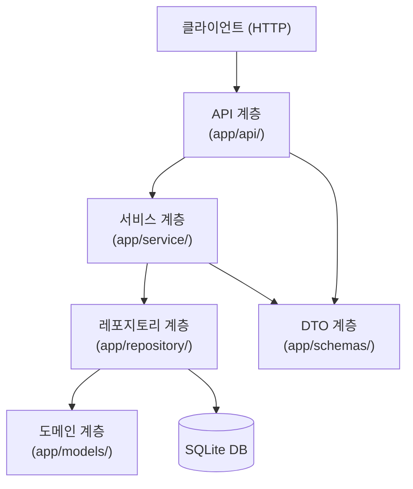
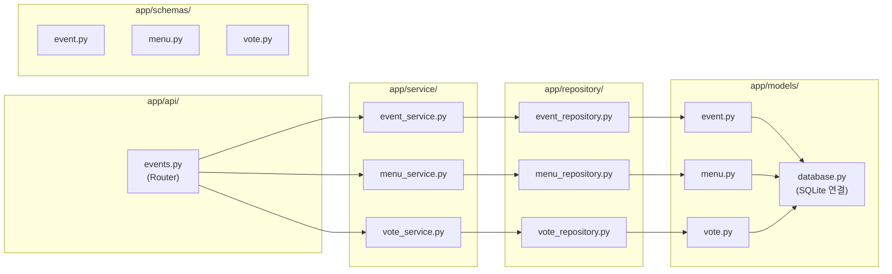
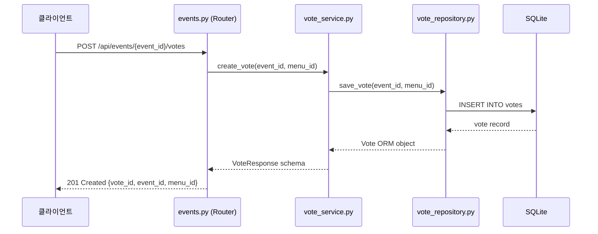
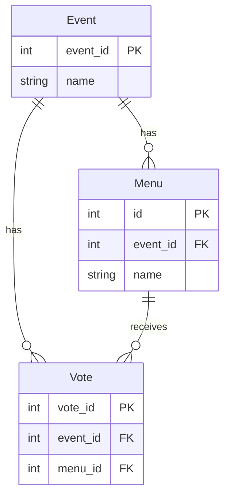

<!-- Auto-generated by /init-ahnlab | Date: 2026-04-21 -->

# 아키텍처 개요

## 아키텍처 패턴

본 프로젝트는 **Layered Architecture(계층형 아키텍처)**를 채택합니다.
각 계층은 단방향 의존성을 유지하며, 계층 간 역방향 의존은 엄격히 금지됩니다.

---

## 계층 구조

---

## 계층별 역할

| 계층 | 디렉토리 | 역할 |
|------|----------|------|
| 프레젠테이션 | `app/api/` | HTTP 요청/응답 처리, FastAPI Router |
| 비즈니스 로직 | `app/service/` | 핵심 도메인 비즈니스 로직 |
| 데이터 접근 | `app/repository/` | SQLite ORM CRUD 로직 |
| 도메인 | `app/models/` | SQLAlchemy ORM 테이블 정의 |
| DTO | `app/schemas/` | Pydantic 입력/출력 스키마 |

---

## 컴포넌트 다이어그램

---

## 데이터 흐름 (투표 예시)

---

## ERD

---

## 설계 원칙

- **단방향 의존성**: api → service → repository → models (역방향 금지)
- **익명 참여**: 별도 인증 없이 누구나 참여 가능
- **이벤트 격리**: 각 이벤트는 독립적인 메뉴 후보와 투표 공간을 보유
- **Pydantic 검증**: 모든 API 입력은 Pydantic v2 스키마로 자동 검증
